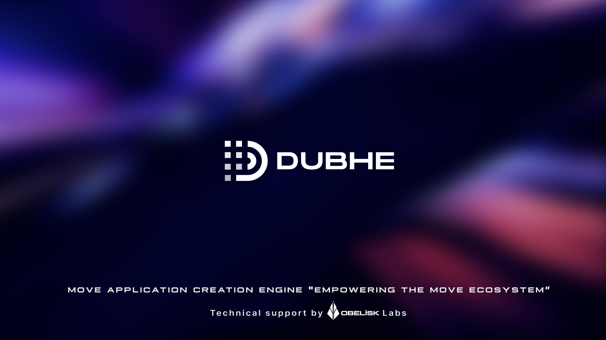

## Dubhe

<div align="center">
  
  <br />
  <a href="https://github.com/0xobelisk/dubhe/releases">
    
  </a>  
 <a href="https://twitter.com/0xObeliskLabs">
    
  </a>
  <a href="https://github.com/0xobelisk/dubhe/stargazers">
    
   </a>
  <a href="https://github.com/0xobelisk/dubhe/network/members">
      
  </a>
</div>

> Dubhe is a community-driven open-source Move Application Creation Engine and Provable Game Engine that provides a comprehensive toolkit for building verifiable Dapps and fully on-chain world/universe-type applications.

In early development, Dubhe aims to reduce project setup time from days to hours through its powerful toolkit and active community contributions.

## 🔑 Key Features

- ⚡️ Built with [Move](https://move-language.github.io/move/)
- 🏛️ Harvard Structural Architecture
- 📦 Structured [Schema-based](https://dubhe-docs.obelisk.build/dubhe/sui/schemas) Storage
- 🌐 Multi-Move Ecosystem Support
- 🛠️ Development Tools:
  - Sandbox Networking & Indexing
  - Type-safe SDKs
  - Hot Updates
  - Logic Upgrades & Data Migration

## 🔮 Roadmap

- 🔐 ZK-login Plugin Integration
- 💰 Transaction Sponsorship Plugin
- 🔄 State Synchronization Client Hooks
- ⚙️ Custom Runtime Sandbox
- 🌍 World Browser Interface

## 📦 Packages

| Package                                                | Description                            | Version                                                                                                                       |
| ------------------------------------------------------ | -------------------------------------- | ----------------------------------------------------------------------------------------------------------------------------- |
| [create-dubhe](./packages/create-dubhe)                | Project scaffolding tool               | [](https://www.npmjs.com/package/create-dubhe)                           |
| [@0xobelisk/sui-cli](./packages/sui-cli)               | Sui CLI for testing, deployment & more | [](https://www.npmjs.com/package/@0xobelisk/sui-cli)               |
| [@0xobelisk/sui-client](./packages/sui-client)         | Sui TypeScript Client                  | [](https://www.npmjs.com/package/@0xobelisk/sui-client)         |
| [@0xobelisk/sui-common](./packages/sui-common)         | Sui Core Utilities                     | [](https://www.npmjs.com/package/@0xobelisk/sui-common)         |
| [@0xobelisk/aptos-cli](./packages/aptos-cli)           | Aptos/Movement CLI Tools               | [](https://www.npmjs.com/package/@0xobelisk/aptos-cli)           |
| [@0xobelisk/aptos-client](./packages/aptos-client)     | Aptos/Movement TypeScript Client       | [](https://www.npmjs.com/package/@0xobelisk/aptos-client)     |
| [@0xobelisk/aptos-common](./packages/aptos-common)     | Aptos/Movement Core Utilities          | [](https://www.npmjs.com/package/@0xobelisk/aptos-common)     |
| [@0xobelisk/rooch-cli](./packages/rooch-cli)           | Rooch CLI Tools                        | [](https://www.npmjs.com/package/@0xobelisk/rooch-cli)           |
| [@0xobelisk/rooch-client](./packages/rooch-client)     | Rooch TypeScript Client                | [](https://www.npmjs.com/package/@0xobelisk/rooch-client)     |
| [@0xobelisk/initia-cli](./packages/initia-cli)         | Initia CLI Tools                       | [](https://www.npmjs.com/package/@0xobelisk/initia-cli)         |
| [@0xobelisk/initia-client](./packages/initia-client)   | Initia TypeScript Client               | [](https://www.npmjs.com/package/@0xobelisk/initia-client)   |
| [@0xobelisk/graphql-client](./packages/graphql-client) | GraphQL Client for Dubhe               | [](https://www.npmjs.com/package/@0xobelisk/graphql-client) |
| [@0xobelisk/ecs](./packages/ecs)                       | ECS Client for Dubhe                   | [](https://www.npmjs.com/package/@0xobelisk/ecs)                       |
| [@0xobelisk/graphql-server](./packages/graphql-server) | GraphQL Server for Dubhe               | [](https://www.npmjs.com/package/@0xobelisk/graphql-server) |

## 🗒 Quick Links

- 📚 [Documentation](https://dubhe-docs.obelisk.build/)
- 🚀 [Quick Start Guide](https://dubhe-docs.obelisk.build/dubhe/sui/quick-start)
- 💬 [Join our Telegram](https://t.me/+0_98p03Fbv1hNzY1)
- 🐛 [Report Issues](https://github.com/0xobelisk/dubhe/issues)

## ⚡ One-Click Install

Use the cross-platform installer scripts to bootstrap `create-dubhe`.

Default behavior: check prerequisites and run `create-dubhe`.
Optional behavior: add `--install-deps` / `-InstallDeps` to auto-install missing Node.js/pnpm.

### macOS / Linux

```bash
curl -fsSL https://raw.githubusercontent.com/0xobelisk/dubhe/main/scripts/install.sh | bash
```

### Windows (PowerShell)

```powershell
irm https://raw.githubusercontent.com/0xobelisk/dubhe/main/scripts/install.ps1 | iex
```

### Windows (CMD)

```cmd
curl -fsSL -o install.ps1 https://raw.githubusercontent.com/0xobelisk/dubhe/main/scripts/install.ps1 && powershell -ExecutionPolicy Bypass -File .\install.ps1
```

### Local Usage (from this repo)

```bash
./scripts/install.sh
```

```powershell
powershell -ExecutionPolicy Bypass -File .\scripts\install.ps1
```

```cmd
.\scripts\install.cmd
```

### Useful Flags

- macOS/Linux: `--install-deps`, `--manager <auto|pnpm|npm>`, `--version <tag>`, `--dry-run`
- Windows: `-InstallDeps`, `-Manager <auto|pnpm|npm>`, `-Version <tag>`, `-DryRun`

### Terminal Coverage

- macOS/Linux: Bash/Zsh/Fish users can run `install.sh` (script executes with Bash).
- Windows: PowerShell users run `install.ps1`, CMD users run `install.cmd`.

## Contributors ✨

Thanks to these outstanding contributors ❤️

<div align="center">
  <a href="https://github.com/0xobelisk/dubhe/graphs/contributors">
    
  </a>
</div>

## ⭐ Star History

<div align="center">
  <a href="https://star-history.com/#0xobelisk/dubhe&Date">
    
  </a>
</div>
