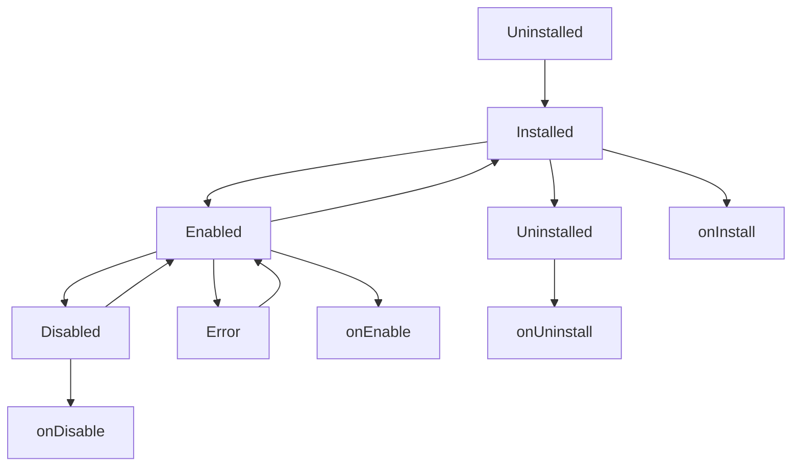
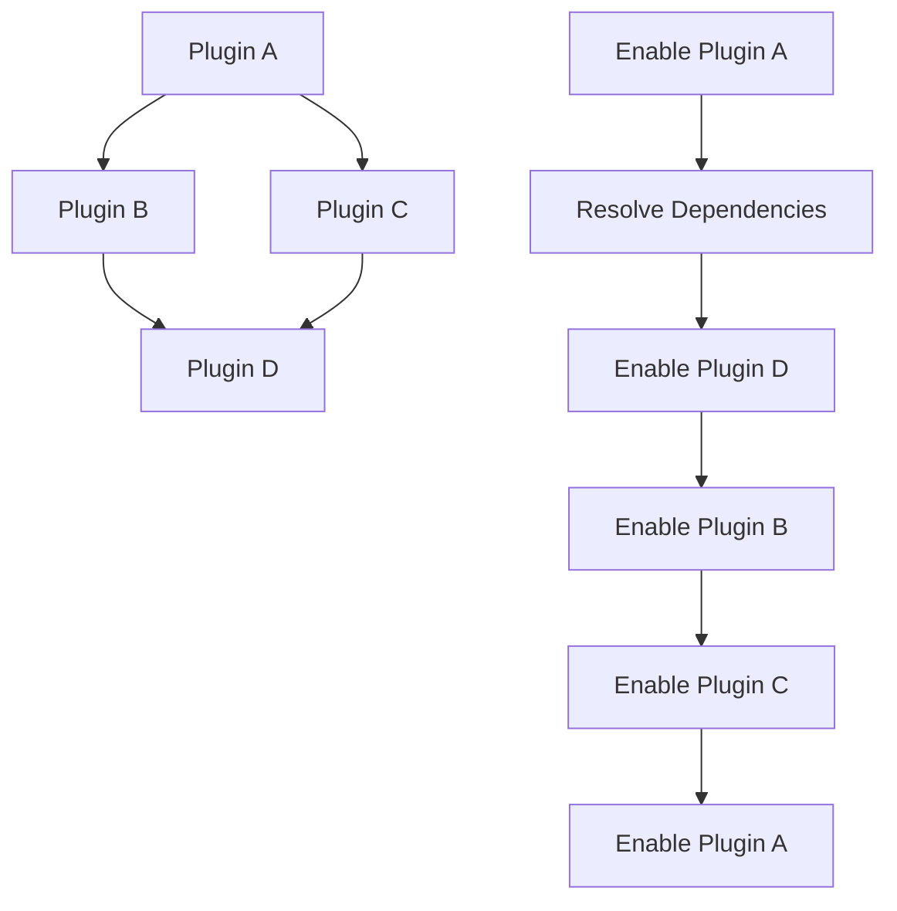
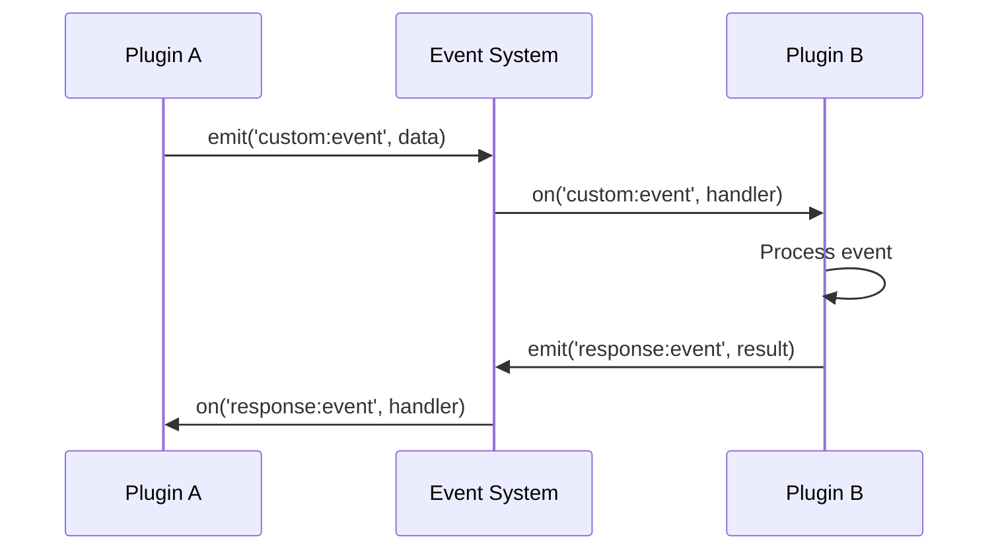

# Dubhe Plugin System Architecture

## 🏗️ 系统架构概览

Dubhe插件系统采用模块化、可扩展的架构设计，支持动态加载、热重载和依赖管理。

```
┌─────────────────────────────────────────────────────────────┐
│                    Dubhe Application                        │
├─────────────────────────────────────────────────────────────┤
│  ┌─────────────────┐  ┌─────────────────┐  ┌──────────────┐ │
│  │   Dubhe Client  │  │   ECS World     │  │   Other      │ │
│  │                 │  │                 │  │   Services   │ │
│  └─────────────────┘  └─────────────────┘  └──────────────┘ │
├─────────────────────────────────────────────────────────────┤
│                    Plugin System Core                       │
│  ┌─────────────────┐  ┌─────────────────┐  ┌──────────────┐ │
│  │ Plugin Manager  │  │ Plugin Loader   │  │ Plugin       │ │
│  │                 │  │                 │  │ Registry     │ │
│  └─────────────────┘  └─────────────────┘  └──────────────┘ │
│  ┌─────────────────┐  ┌─────────────────┐  ┌──────────────┐ │
│  │ Plugin Storage  │  │ Event System    │  │ Logger       │ │
│  │                 │  │                 │  │              │ │
│  └─────────────────┘  └─────────────────┘  └──────────────┘ │
├─────────────────────────────────────────────────────────────┤
│                    Plugin Layer                             │
│  ┌─────────────────┐  ┌─────────────────┐  ┌──────────────┐ │
│  │  Walrus Plugin  │  │ Custom Plugin   │  │ Third-party  │ │
│  │                 │  │                 │  │ Plugin       │ │
│  └─────────────────┘  └─────────────────┘  └──────────────┘ │
├─────────────────────────────────────────────────────────────┤
│                    External Services                        │
│  ┌─────────────────┐  ┌─────────────────┐  ┌──────────────┐ │
│  │  Walrus API     │  │  Other APIs     │  │  Databases   │ │
│  │                 │  │                 │  │              │ │
│  └─────────────────┘  └─────────────────┘  └──────────────┘ │
└─────────────────────────────────────────────────────────────┘
```

## 🔧 核心组件

### 1. Plugin System Core

#### PluginManager

- **职责**: 管理插件的生命周期、状态和依赖关系
- **功能**:
  - 插件注册/卸载
  - 插件启用/禁用
  - 依赖解析
  - 状态管理

#### PluginLoader

- **职责**: 从文件系统或网络加载插件
- **功能**:
  - 动态加载插件
  - 插件验证
  - 元数据解析

#### PluginRegistry

- **职责**: 管理插件工厂和类型注册
- **功能**:
  - 插件工厂注册
  - 插件类型管理
  - 插件创建

#### PluginStorage

- **职责**: 为插件提供持久化存储
- **功能**:
  - 数据保存/加载
  - 配置管理
  - 缓存支持

#### Event System

- **职责**: 提供插件间通信机制
- **功能**:
  - 事件发布/订阅
  - 插件间解耦
  - 异步通信

### 2. Plugin Layer

#### Walrus Plugin

- **功能**: 集成Walrus NFT平台
- **特性**:
  - NFT元数据查询
  - 用户NFT列表
  - NFT搜索
  - 价格信息

#### Custom Plugins

- **功能**: 开发者自定义插件
- **特性**:
  - 灵活的生命周期
  - 自定义API
  - 配置管理

## 🔄 插件生命周期



### 生命周期钩子

1. **onInstall**: 插件安装时调用

   - 验证配置
   - 初始化资源
   - 注册组件

2. **onEnable**: 插件启用时调用

   - 解析依赖
   - 注册事件监听器
   - 启动服务

3. **onDisable**: 插件禁用时调用

   - 停止服务
   - 移除事件监听器
   - 清理资源

4. **onUninstall**: 插件卸载时调用
   - 完全清理资源
   - 移除注册的组件

## 🔌 插件接口

### Plugin Interface

```typescript
interface Plugin {
  metadata: PluginMetadata;
  config: PluginConfig;
  status: PluginStatus;
  error?: Error;

  onInstall?(context: PluginContext): Promise<void> | void;
  onEnable?(context: PluginContext): Promise<void> | void;
  onDisable?(context: PluginContext): Promise<void> | void;
  onUninstall?(context: PluginContext): Promise<void> | void;
}
```

### Plugin Context

```typescript
interface PluginContext {
  dubhe: Dubhe; // Dubhe实例
  world: World; // ECS世界
  pluginManager: PluginManager; // 插件管理器
  config: PluginConfig; // 插件配置
  metadata: PluginMetadata; // 插件元数据
  logger: PluginLogger; // 日志记录器
  events: PluginEventEmitter; // 事件发射器
}
```

## 📦 插件类型

### 1. 内置插件 (Built-in Plugins)

- 与Dubhe核心功能紧密集成
- 提供基础服务
- 示例: Walrus Plugin

### 2. 第三方插件 (Third-party Plugins)

- 由社区开发
- 扩展Dubhe功能
- 独立维护

### 3. 自定义插件 (Custom Plugins)

- 开发者根据需求创建
- 特定业务逻辑
- 私有使用

## 🔗 依赖管理

### 依赖类型

1. **Required Dependencies**: 必需依赖

   - 插件无法在没有依赖的情况下运行
   - 系统会强制检查

2. **Optional Dependencies**: 可选依赖

   - 插件可以在没有依赖的情况下运行
   - 提供降级功能

3. **Peer Dependencies**: 对等依赖
   - 插件期望宿主环境提供
   - 避免版本冲突

### 依赖解析



## 🗄️ 存储架构

### 存储层次

```
Plugin Storage
├── System Storage
│   ├── Configuration
│   ├── Plugin Registry
│   └── System State
├── Plugin Storage
│   ├── Plugin A
│   │   ├── Config
│   │   ├── Data
│   │   └── Cache
│   └── Plugin B
│       ├── Config
│       ├── Data
│       └── Cache
└── Backup Storage
    ├── Plugin A Backups
    └── Plugin B Backups
```

### 存储接口

```typescript
interface PluginStorage {
  save(pluginId: string, key: string, data: any): Promise<void>;
  load(pluginId: string, key: string): Promise<any>;
  delete(pluginId: string, key: string): Promise<void>;
  exists(pluginId: string, key: string): Promise<boolean>;
  keys(pluginId: string): Promise<string[]>;
}
```

## 📡 事件系统

### 事件类型

1. **系统事件**

   - `plugin:registered`
   - `plugin:unregistered`
   - `plugin:enabled`
   - `plugin:disabled`

2. **业务事件**

   - `transaction:confirmed`
   - `nft:transferred`
   - `wallet:connected`

3. **自定义事件**
   - 插件定义的事件
   - 跨插件通信

### 事件流



## 🔒 安全架构

### 安全层

1. **配置安全**

   - API密钥管理
   - 环境变量
   - 权限控制

2. **运行时安全**

   - 输入验证
   - 资源限制
   - 错误隔离

3. **数据安全**
   - 数据加密
   - 访问控制
   - 审计日志

### 权限模型

```typescript
interface PluginPermissions {
  network: boolean; // 网络访问权限
  storage: boolean; // 存储访问权限
  events: boolean; // 事件系统权限
  dubhe: boolean; // Dubhe API权限
  ecs: boolean; // ECS系统权限
}
```

## 🚀 性能优化

### 缓存策略

1. **内存缓存**

   - 插件数据缓存
   - API响应缓存
   - 配置缓存

2. **持久化缓存**
   - 文件系统缓存
   - 数据库缓存
   - 分布式缓存

### 懒加载

1. **插件懒加载**

   - 按需加载插件
   - 延迟初始化
   - 资源优化

2. **功能懒加载**
   - 按需加载功能
   - 动态导入
   - 代码分割

## 🔧 扩展点

### 1. 插件加载器扩展

- 支持从NPM包加载
- 支持从Git仓库加载
- 支持从CDN加载

### 2. 存储后端扩展

- 支持数据库存储
- 支持云存储
- 支持分布式存储

### 3. 事件系统扩展

- 支持WebSocket事件
- 支持消息队列
- 支持流式事件

### 4. 监控系统扩展

- 性能监控
- 错误监控
- 使用统计

## 📊 监控和可观测性

### 监控指标

1. **插件指标**

   - 插件数量
   - 启用/禁用状态
   - 错误率

2. **性能指标**

   - 加载时间
   - 响应时间
   - 内存使用

3. **业务指标**
   - API调用次数
   - 缓存命中率
   - 事件处理量

### 日志系统

```typescript
interface PluginLogger {
  debug(message: string, ...args: any[]): void;
  info(message: string, ...args: any[]): void;
  warn(message: string, ...args: any[]): void;
  error(message: string, ...args: any[]): void;
  fatal(message: string, ...args: any[]): void;
}
```

## 🔄 部署架构

### 开发环境

```
┌─────────────────┐
│   Development   │
│   Environment   │
├─────────────────┤
│  Hot Reload     │
│  File Watching  │
│  Debug Mode     │
└─────────────────┘
```

### 生产环境

```
┌─────────────────┐
│   Production    │
│   Environment   │
├─────────────────┤
│  Plugin Cache   │
│  Load Balancing │
│  Monitoring     │
└─────────────────┘
```

## 🎯 最佳实践

### 1. 插件设计

- 单一职责原则
- 接口隔离
- 依赖注入

### 2. 错误处理

- 优雅降级
- 错误恢复
- 用户反馈

### 3. 性能优化

- 异步操作
- 资源复用
- 缓存策略

### 4. 安全考虑

- 输入验证
- 权限控制
- 数据保护

---

**版本**: 1.0.0  
**最后更新**: 2024年12月  
**维护者**: Dubhe Team
